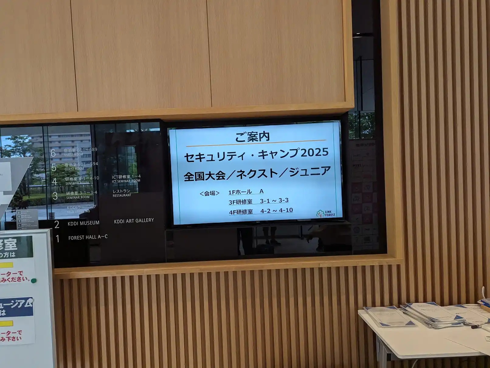

## はじめに

2025年8月12日から16日にかけて開催されたセキュリティ・キャンプ全国大会に、チューターとして参加してきました。

セキュリティ・キャンプは、次世代のセキュリティ人材を育成するための集中講座で、全国から選抜された学生が参加する日本最大級のセキュリティ教育イベントです。昨年度は受講生として参加し、今年度はチューターという立場で関わることができました。

立場が変わったことで見えてきた新たな学びや気づきがあったので、参加記としてまとめておきます。

担当したクラスは専門B(プロダクトセキュリティクラス)で、2年前まではWebセキュリティクラスで、それよりも前はネットワークセキュリティクラスでした。
今年度のプロダクトセキュリティクラスでは無敗塾という架空のEdTech企業を題材にそれぞれの講義が組み立てられていました。
無敗塾のコンセプトについてはプロデューサーのスライドに説明を譲ります。

{/* textlint-disable ja-technical-writing/sentence-length */}
{/* textlint-disable ja-technical-writing/ja-no-mixed-period */}

<a href="https://www.docswell.com/s/tanafuji-sec/KEYWDG-2025-seccamp-b">セキュリティ・キャンプ2025 全国大会 【専門】Bクラス　共通シナリオ + 講義概要紹介 by @tanafuji-sec</a>

{/* textlint-enable */}

以下のリンクはIPAのセキュリティ・キャンプ事業ページです。興味があれば覗いてみてください。

https://www.ipa.go.jp/jinzai/security-camp/2025/camp/index.html

## B1『クラウドプラットフォーム監視入門』

今回のBクラスでは、ログを収集・分析することが重要なテーマとなっていました。
一番最初の講義は、実際にクラウド環境のログをどのように収集・分析するかを学ぶ内容でした。
昨年度はGoogle Cloudでしたが、無敗塾がAWSを採用しているというコンセプトだったので、AWS上に監視基盤の構築をするにどのようにログを収集、加工、格納するのかを学びました。

演習自体も学んだ内容をGoで実装し、Lambdaで動かすという内容でした。
演習がしやすいように、AWS上のエディタを用いて実装したりと、受講生が取り組みやすいように配慮がなされていました。

アラート監視システムにはWarremという水谷さんが開発されているOSSが使われていました。

https://github.com/secmon-lab/warren

https://zenn.dev/mizutani/articles/secmon-warren

演習などを見ていると、SQLの知識は分析フェーズで欠かせなく、最近だとLLMを使ってSQLを生成することも出来ますが、サクッとSQLを書けることは収集したログを分析する上で重要なスキルだと感じました。

https://github.com/m-mizutani/seccamp-2025-b1

## B2『設計・開発・テストにおけるセキュリティの実践と考え方を知ろう』

400枚を超えるボリュームのある講義でした。時間内には収まりきらない内容でしたが、このクラスでは事後学習が重要だということが事前準備の段階から伝えられていたので、講義後にも学べるリソースがあるのは受講生にとってありがたいことだと思いました。
実際にプロダクトを作る上で、セキュリティは開発を阻害するものではなく、むしろビジネス的な価値を生み出すための投資であるという考え方が非常に気に入りました。

脅威モデリングを行い、受講生の活発なコミュニケーションが見られ、自分も参加したくなるような雰囲気でした。

最後に学生向けの継続的学習のためのリソースも紹介され、受講生が今後も学び続けるための道筋が示されていました。
セキュリティ・キャンプを機に他のイベントに参加してみたりしてキャリアを歩まれている方も多いので、受講生にとっては嬉しいのではないかなと思いました。

{/* textlint-disable ja-technical-writing/sentence-length */}
{/* textlint-disable ja-technical-writing/ja-no-mixed-period */}

<a href="https://www.docswell.com/s/a-zara-n/KPGX74-2025-08-14-143959">設計・開発・テストにおけるセキュリティの実践と考え方を知ろう by @a-zara-n</a>

{/* textlint-enable */}

## B3『デジタルアイデンティティの基礎と最新認証技術パスキーの実装』

昨今、アカウントの乗っ取りやフィッシング詐欺が増加しており、認証に関してはホットな話題です。

https://www.nikkei.com/article/DGXZQOUD282OI0Y5A720C2000000/

デジタルアイデンティティの基礎から始まり、マイナンバーカード、JPKIといった実装例を学び、パスキーを学ぶ上で重要なFIDO, OAuth, OIDCについて実装不備の事例を交えながら学びました。
最後に座学の総括として、実際にパスキー、OIDCを軽く実装する演習が行われました。

「パスキーのすべて」が受講生に配布されており、パスキーの理解を深めるためのリソースとして活用されていました。

https://gihyo.jp/book/2025/978-4-297-14653-5

OAuth2.1についても触れられており、最新の技術を学べました。

実際に認証認可に関しては実装不備を起こすと大きなセキュリティインシデントに繋がりますし、機会は多いのでフローや仕様について考えながら学習できたのは貴重な体験でした。

{/* textlint-disable ja-technical-writing/no-exclamation-question-mark */}
{/* textlint-disable ja-technical-writing/ja-no-successive-word */}
{/* textlint-disable ja-technical-writing/sentence-length */}
{/* textlint-disable ja-technical-writing/ja-no-mixed-period */}
<blockquote class="twitter-tweet">
セキュリティ・キャンプでデジタルアイデンティティやパスキーの解説をさせてもらいました！！  次世代を担う学生のみなさんに少しでもIDについて興味を持ってもらえたら嬉しいです！！<a href="https://twitter.com/hashtag/seccamp?src=hash&amp;ref_src=twsrc%5Etfw">#seccamp</a> <a href="https://twitter.com/hashtag/%E3%83%91%E3%82%B9%E3%82%AD%E3%83%BC?src=hash&amp;ref_src=twsrc%5Etfw">#パスキー</a> <a href="https://twitter.com/hashtag/OpenID?src=hash&amp;ref_src=twsrc%5Etfw">#OpenID</a> <a href="https://t.co/dif8ghXPH0">https://t.co/dif8ghXPH0</a>
&mdash; kura (@kura_lab) <a href="https://twitter.com/kura_lab/status/1955486422070333835?ref_src=twsrc%5Etfw">August 13, 2025</a></blockquote>  
{/* textlint-enable */}

## B4『Kubernetesで学ぶクラウドネイティブ時代のプラットフォームセキュリティ』

無敗塾はKubernetesを採用しているのでKubernetesのセキュリティについて学ぶ講義でした。
特に昨今の開発ではコンテナを使った開発は主流になり、Kuberetesはオーケストレーションツールとして広く使われています。

いくつか演習が行われたのですが、中でも印象的なのは、Kubernetes上に構築されたシステムのデータフロー図が渡され、そこから脅威を洗い出すという演習でした。
実際に図の環境は手元で動かせるのでそれを元に探ったり、コマンドを駆使して探ったり、図だけで探ったりと受講生の中でも様々なアプローチが見られました。

演習に関してはEC2上のインスタンスに構築されたKind環境上で、各班ごとに環境を突く形が取られていました。チーム内で活発に議論が行われていたのは印象的でした。

実際に演習に関しては好きな課題をピックアップしそれぞれが取り組まれていました。自分はまだ手を動かせていないのでこの記事を書き終わったらやってみます。（宣言）

https://github.com/kyohmizu/seccamp2025-B4

## B5『モダンなプロダクト開発を攻撃者の視点で捉える』

このクラスの受講生の多くがどちらかというと開発寄りの方が多い印象にあるため、この講義の内容は斬新だったでしょう。

現在の開発環境においてどんな脅威があるのか、そしてどういう対策を施さないといけないのかを受講生同士で議論しながら学ぶ内容でした。

セキュリティは正解のない長い船旅なんだなと感じました。

{/* textlint-disable ja-technical-writing/sentence-length */}
<blockquote class="twitter-tweet">
受講生のみなさま、積極的なご参加ありがとうございました。サポート頂いたチューターのお二人、プロデューサーの藤田さん、運営の皆さまにお礼申し上げます。 <a href="https://t.co/6JQd4eJv2C">https://t.co/6JQd4eJv2C</a>
&mdash; Tinydile (@Tinydile) <a href="https://twitter.com/Tinydile/status/1955894140333645855?ref_src=twsrc%5Etfw">August 14, 2025</a></blockquote>  
{/* textlint-enable */}

## B6『APIセキュリティ設計：脅威に負けないアーキテクチャ構築戦略』

実際私は事前学習の段階ではアーキテクチャに関しては精通しておらず、クリーンアーキテクチャが流行っているんだなというくらいの認識でした。
「マスタリングAPIアーキテクチャ」を読みそもそもアーキテクチャが何なのか、どうすればセキュアに設計できるのかを学ぶことができました。

https://www.oreilly.co.jp/books/9784814400898/

講義内ではアーキテクチャという単語の定義から始まり、セキュリティアーキテクトの役割や、APIアーキテクチャの脅威モデリングを行ったり、改善についての議論が行われていました。

自分も講義の最初の方にざっくりとした脅威に関して洗い出していましたが、受講生の様子を見ていると、皆違うアプローチから入っていって、非常に勉強になりました。

これからアーキテクチャについて学ぶ書籍が列挙されており、自分としてもかなり勉強になりました。

## おわりに

プロダクトセキュリティを語る上では、インフラからアプリケーション、認証認可、アーキテクチャ設計まで、あらゆるレイヤーの知識が必要だなと改めて感じました。

はじめてのチューターという立場で参加しましたが、受講生の皆さんの積極的な姿勢と鋭い質問から、むしろ自分が学ばせていただくことも多く、非常に充実した5日間でした。

来年度以降、セキュリティ・キャンプへの参加を検討している方は、ぜひ挑戦してみてください。技術的な学びはもちろん、全国から集まる仲間との出会いは、かけがえのない財産になるはずです。

最後に、プロデューサーの藤田さんをはじめ、講師の皆さん、相方のチューターの方、そして運営の皆さんに感謝申し上げます。

